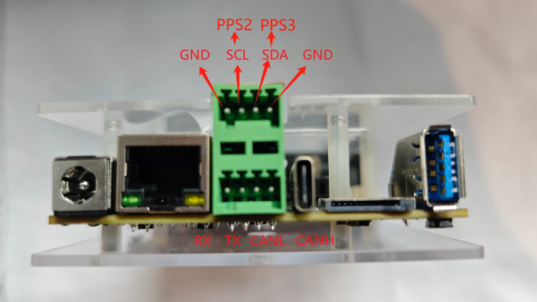
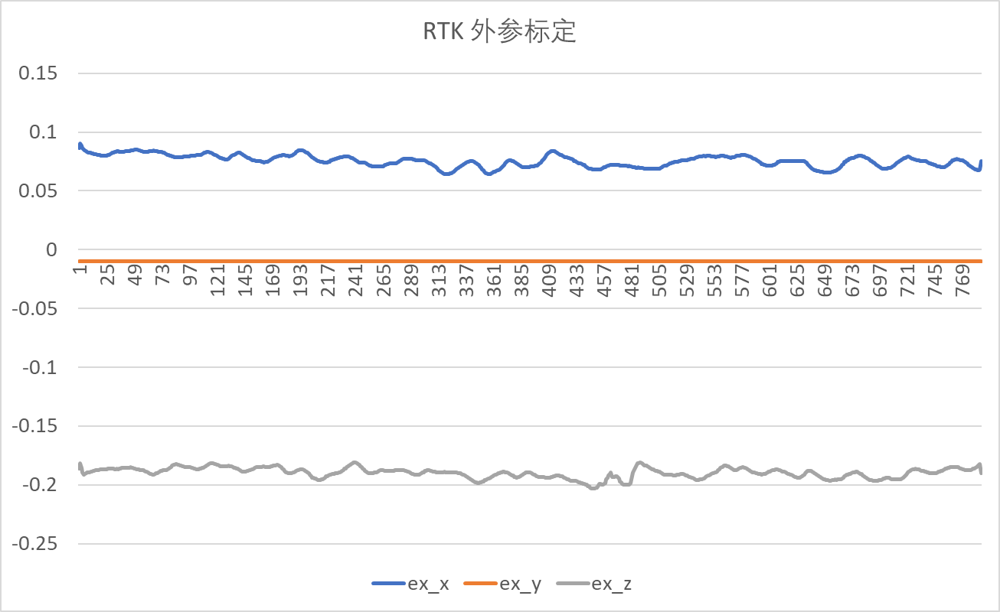

# HM_RTK_Driver
本仓库是黑森矩阵的RTK驱动仓库，包含两部分：
- 驱动层，配合viobot2使用。
- RTK与Viobot2的外参标定工具

使用本仓库 搭配 viobot2 使用，viobot2可以输出融合RTK后的轨迹`/baton/stereo3/fusion_odom` 和 `/baton/stereo3/fusion_path`。

## preinstall
- ros 
- Eigen3
  
以下是外参标定工具需要，如果不标定外参可忽略。 
- glog  # 实测 glog-0.6.0
- ceres # 实测 2.1.0

## 编译
```
    mkdir -p HM_RTK_Driver_ws/src
    cd HM_RTK_Driver_ws/src
    git clone https://github.com/Hessian-matrix/HM_RTK_driver
    cd HM_RTK_driver
    git submodule init
    git submodule update
    cd ../../
    catkin_make
```

## RTK驱动

### 硬件时间同步
在接入RTK时，需要viobot2与RTK进行时间同步。
- 如果viobot2使用自带GNSS模块已链接天线，viobot2已自动与GNSS进行时间同步。无需其他操作。
- 如果viobot2没有连接GNSS天线，就需要将RTK的PPS信号与viobot2进行时间同步。基本通讯是通过尾板的I2C接口的复用。
  
  - 将尾板I2C6 复用成 PPS，可复用两路PPS， 电平为3.3V，注意同步设备与viobot要共地。
    ``` bash
        # 进root账户
        cp kernel/I2CtoPPS /opt/
        dd if=/opt/I2CtoPPS  of=/dev/mmcblk0p3 # 不要断电，直接命令重启
        reboot
    ```
    - 检查：`ls /dev/pps*` 、 `apt install pps-tools & ppstest /dev/pps2`， 有正常输出即可
  - 恢复：
    ``` bash
        # 进root账户
        cp kernel/PPStoI2C /opt/
        dd if=/opt/PPStoI2C  of=/dev/mmcblk0p3 # 不要断电，直接命令重启
        reboot
    ```
    - 检查：`ls /dev/i2c*` 有/dev/i2c-6 证明已经可以

### 使用
- 使用前先确定已硬件时间同步
- 配置RTK的外参到src/HM_RTK_driver/launch/HM_RTK.launch中的ex_rtk_slam_x、ex_rtk_slam_y、ex_rtk_slam_z
- 配置RTK需要的Ntrip服务。
- 运行 ` roslaunch hm_rtk HM_RTK.launch `
  - 输出`serial try to write:XXXX, real write=XXXX, drop=0` 则RTK串口和NTrip正常
  - 输出的NMEA（GGA）信息，可以查看目前定位结果、状态.


## 外参标定工具（参考）
我们使用的是单RTK模组进行融合，外参标定只需要标定2个参数：水平平移。
- 单RTK没有朝向信息， ECEF坐标系固定东北天
- 对于一般小车场景应用标定来说，采用随机水平移动/绕8移动 标定，高程方向不可观，优化时固定。

### 标定原理
采用水平快速随机运动同时采集： viobot2轨迹(左目到世界坐标系的变换) + RTK轨迹（ecef坐标系）， 进行两者轨迹对齐，来进行外参标定。
$
    p_{ecef} = R_{enu}^{ecef}[R_{yaw}(R_{cam}^{local}t_{ex}+p_{cam})] + ref_{ecef} 
$

$
p_{cam} = R_{yaw}^{-1}R_{ecef}^{enu}(p_{ecef}-ref_{ecef})-R_{cam}^{local}t_{ex}
$

可以同时获取 $yaw、t_{ex}、ref_{ecef}$

### 使用
- viobot2 开机，运行上位机，配置：关闭GNSS, 打开RTK，重启。
- 开启算法, 用于发布 viobot2轨迹
- 运行RTK的驱动算法， 用于发布RTK轨迹
    ` roslaunch hm_rtk HM_RTK.launch `
    - 保证RTK是固定解：
      ` rostopic echo /rtk_navsatfix` 的 status = 2
- 在开阔场景，保证RTK是固定解的情况下, 运行标定算法
  ` roslaunch hm_rtk calib_rtk_slam.launch `
- 快速绕8运动（或随机运动），保证在10s时间内包含不同方向的运动。（避免静止或直线运动）
- 会实时输出标定结果。
- 也可以将标定结果导出到文件，用Excel查看外参标定。


### 注意事项

- 随机多方向快速运动，避免静止或直线运动。推荐绕8运动，保证标定精度的关键
- 10s内保证包含多方向运动，算法截取最新的10s数据进行标定