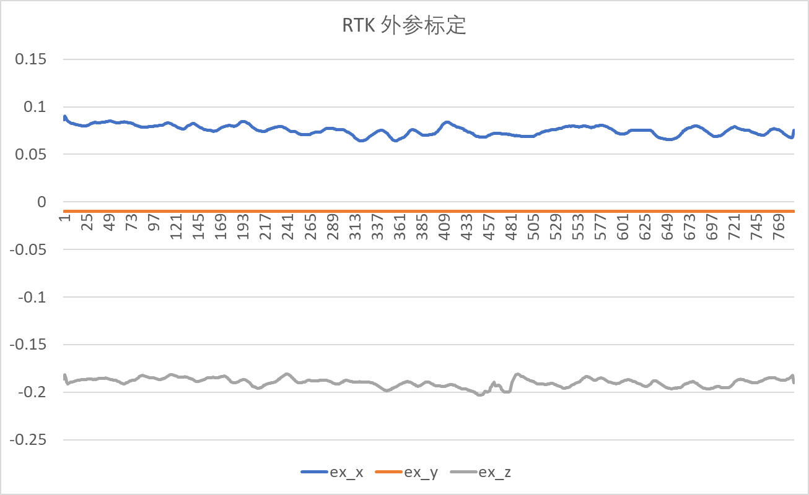

# HM_RTK_Driver
本仓库是黑森矩阵的RTK驱动仓库，包含两部分：
- 驱动层，配合viobot2使用。
- RTK与Viobot2的外参标定工具

使用流程：先基于外参标定工具，进行RTK与viobot2外参标定。然后再使用RTK驱动发布RTK相关话题：
  - `/rtk_extrinsic`  用于发布RTK到viobot2的外参，给viobot2使用。
  - `/rtk_nmea`       用于将NMEA的GGA数据字符串发送给viobot2使用。

搭配 viobot2 使用，viobot2可以输出融合RTK后的轨迹
  - `/baton/stereo3/fusion_odom`  融合后的里程计信息，在SLAM局部坐标系
  - `/baton/stereo3/fusion_path`  融合后的历史轨迹, 在SLAM局部坐标系
  - `/baton/stereo3/rtk_path`     RTK历史轨迹，在SLAM局部坐标系
  - `/baton/stereo3/lla_odom`     融合后的odometry，XYZ是经纬高（单位:度、米），朝向是在东北天坐标系下

注意：
  - 本教程数据流： 
    - Ntrip： 网络→viobot2 → RTK 串口
    - NMEA: RTK串口 → viobot2 
  - 如果RTK已经配置好了Ntrip服务，则只需要：
    - NMEA: RTK串口 → viobot2 
  - 如有其他需求，代码已开源，可以自行修改，驱动最终只需要满足：
    - RTK与viobot2 进行时间同步
    - 能发布两个话题：
      - `/rtk_extrinsic`  用于发布RTK到viobot2的外参，给viobot2使用。
      - `/rtk_nmea`       用于将NMEA的GGA数据字符串发送给viobot2使用。

## preinstall
- ros 
- Eigen3
  
以下是外参标定工具需要，如果不标定外参可忽略。 
- glog  # 实测 glog-0.6.0
- ceres # 实测 2.1.0

## 编译
```
    mkdir -p HM_RTK_Driver_ws/src
    cd HM_RTK_Driver_ws/src
    git clone https://github.com/Hessian-matrix/HM_RTK_driver
    cd HM_RTK_driver
    git submodule init
    git submodule update
    cd ../../
    catkin_make
```

## 硬件时间同步
在接入RTK时，需要viobot2与RTK进行时间同步。
- 如果viobot2使用自带GNSS模块已链接天线，viobot2已自动与GNSS进行时间同步。无需其他操作。
- 如果viobot2没有连接GNSS天线，就需要将RTK的PPS信号与viobot2进行时间同步。主板底下有一个10pins的排线接口，


- 定义如下，其中包含了两个串口接口uart3和uart4，以及PPS信号线。需要接PPS的只要把PPS接好并共地即可。


## 外参标定工具（参考）
我们使用的是单RTK模组进行融合，外参标定只需要标定2个参数：水平平移。
- 单RTK没有朝向信息， ECEF坐标系朝向固定
- 对于一般小车场景应用标定来说，采用随机水平移动/绕8移动 标定，高程方向不可观，优化时固定。
- 对于无人机用户，可以自己设计修改标定程序，满足3DOF外参标定。（同时可欢迎适配好的小伙伴来commit ~ ）
- 当整个硬件已设计完毕，可从硬件结构图来获取外参结果，无需标定。

### 标定原理
采用水平快速随机运动同时采集： viobot2轨迹(左目到世界坐标系的变换) + RTK轨迹（ecef坐标系）， 进行两者轨迹对齐，来进行外参标定。

$$
    \begin{aligned} p_{ecef} &= R_{enu}^{ecef}[R_{yaw}(R_{cam}^{local}t_{ex}+p_{cam})] + ref_{ecef} \\ 
    p_{cam} &= R_{yaw}^{-1}R_{ecef}^{enu}(p_{ecef}-ref_{ecef})-R_{cam}^{local}t_{ex}\end{aligned}
$$


可以同时获取 $yaw、t_{ex}、ref_{ecef}$

### 使用
- viobot2 开机，运行上位机，配置：关闭GNSS, 打开RTK，重启。
- 开启算法, 用于发布 viobot2轨迹
- 运行RTK的驱动算法， 用于发布RTK轨迹
    ` roslaunch hm_rtk HM_RTK.launch `
    - 保证RTK是固定解：
      ` rostopic echo /baton/rtk` 的 status = 2
- 配置初始外参
  - 配置src/HM_RTK_driver/launch/calib_rtk_slam.launch 文件，设定外参初值。
  - 坐标系：以左目为原点，XYZ-右下前。即 T_camL<-RTK
  - 由于高程方向不可观，所以y轴方向必须设定初值（可手动测量），标定过程固定，不参与优化。
- 在开阔场景，保证RTK是固定解的情况下, 运行标定算法
  ` roslaunch hm_rtk calib_rtk_slam.launch `
- **快速**绕8运动（或随机运动），保证在10s时间内包含不同方向的运动。（避免静止或直线运动）
- 会实时输出标定结果，最后也会输出标定均值，具体结果也导出到了文件(HM_RTK/results/rtk_slam_calib_results.csv)。
- 也可以将标定结果文件，用Excel查看外参标定。


### 注意事项

- 随机多方向快速运动，避免静止或直线运动，推荐绕8运动。
- 10s内保证包含多方向运动，算法截取最新的10s数据进行标定


## RTK驱动

### 使用
- 使用前先确定已硬件时间同步
- 配置src/HM_RTK_driver/launch/HM_RTK.launch
  - RTK的数据端口和波特率
  - RTK需要的Ntrip服务（又称Cors账号）。[Ntrip简介](https://blog.csdn.net/weixin_46014563/article/details/120450726) ，推荐使用千寻的Ntrip服务
  - RTK的外参：ex_rtk_slam_x、ex_rtk_slam_y、ex_rtk_slam_z， 坐标系: 以左目为原点, XYZ-右下前
- 运行 ` roslaunch hm_rtk HM_RTK.launch `
  - 输出`serial try to write:XXXX, real write=XXXX, drop=0` 则RTK串口和NTrip正常
  - 输出的NMEA（GGA）信息，可以查看目前定位结果、状态.
  - 会输出两个topic：
    - /rtk_extrinsic 配置的外参, T_camL<-RTK
    - /rtk_nmea      收到的NMEA的GGA语句
- 运行后，再跑viobot2上位机算法。打开RTK(操作-设置-GNSS-勾选RTK选项，设置后需重启设备)，打开算法，则将RTK与VIO轨迹进行耦合。
  - 需初始化，一般在RTK固定解后运动10m以上距离即可初始化成功。
    - 固定解查看依据(二选一即可):
      1. rostopic echo /baton/rtk 的 status = 2
      2. rostopic echo /rtk_nmea 的 $GPGGA,<1>,<2>,<3>,<4>,<5>,<6>,<7>,<8>,<9>,M,<10>,M,<11>,<12>*xx<CR><LF> 当<6>=4时是固定解
  - 融合结果,在上位机界面不显现。但会播发以下topic，可在rviz等查看, 参考：
    - `/baton/stereo3/fusion_odom`  融合后的odometry，在SLAM局部坐标系下
    - `/baton/stereo3/fusion_path`  融合后的历史轨迹，在SLAM局部坐标系下
    - `/baton/stereo3/rtk_path`     RTK历史轨迹，在SLAM局部坐标系下
    - `/baton/stereo3/lla_odom`     融合后的odometry，XYZ是经纬高，朝向在东北天坐标系下