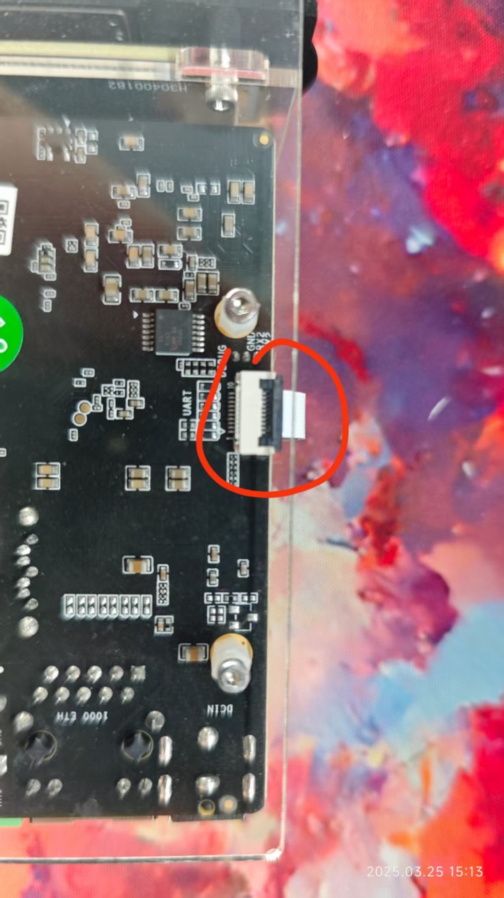
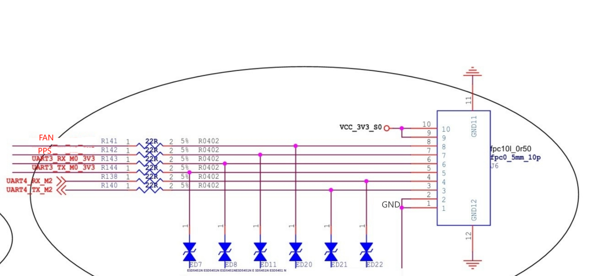

# HM_RTK_Driver
本仓库是黑森矩阵的RTK驱动仓库,同时支持ROS1和ROS2，包含两部分：
- 驱动层，配合viobot2使用。
- RTK与Viobot2的外参标定工具（支持3DOF和6DOF RTK两种模式）

使用流程：先基于外参标定工具，进行RTK与viobot2外参标定。然后再使用RTK驱动发布RTK相关话题：
  - `/rtk_extrinsic`  用于发布RTK到viobot2的外参，给viobot2使用。
  - `/rtk_nmea`       用于将NMEA的GGA数据字符串发送给viobot2使用。

搭配 viobot2 使用，viobot2可以输出融合RTK后的轨迹
  - `/baton/stereo3/fusion_odom`  融合后的里程计信息，在SLAM局部坐标系
  - `/baton/stereo3/fusion_path`  融合后的历史轨迹, 在SLAM局部坐标系
  - `/baton/stereo3/rtk_path`     RTK历史轨迹，在SLAM局部坐标系
  - `/baton/stereo3/lla_odom`     融合后的odometry，XYZ是经纬高（单位:度、米），朝向是在东北天坐标系下

注意：
  - 本教程数据流： 
    - Ntrip： 网络→viobot2 → RTK 串口
    - NMEA: RTK串口 → viobot2 
  - 如果RTK已经配置好了Ntrip服务，则只需要：
    - NMEA: RTK串口 → viobot2 
  - 如有其他需求，代码已开源，可以自行修改，驱动最终只需要满足：
    - RTK与viobot2 进行时间同步
    - 能发布两个话题：
      - `/rtk_extrinsic`  用于发布RTK到viobot2的外参，给viobot2使用。
      - `/rtk_nmea`       用于将NMEA的GGA数据字符串发送给viobot2使用。

## 新功能说明
### 双模式外参标定支持
- **模式1（传统）**: 3DOF RTK（仅位置信息） + 6DOF SLAM → 2DOF水平外参标定
- **模式2（升级）**: 6DOF RTK（位置+姿态信息） + 6DOF SLAM → 5DOF外参标定（高程方向仍不可观）

系统会根据接收到的RTK数据类型自动选择模式：
- 接收 `/baton/rtk` (sensor_msgs::NavSatFix) → 3DOF模式
- 接收 `/baton/rtk_sixdof` (nav_msgs::Odometry) → 6DOF模式

## preinstall
- ros 
- Eigen3
  
以下是外参标定工具需要，如果不标定外参可忽略。 
- glog  # 实测 glog-0.6.0
- ceres # 实测 2.1.0

## 编译

### 完整安装流程
```bash
# 1. 创建工作空间
mkdir -p HM_RTK_Driver_ws/src
cd HM_RTK_Driver_ws/src

# 2. 克隆仓库
git clone https://github.com/Hessian-matrix/HM_RTK_driver
cd HM_RTK_driver

# 3. 初始化并更新所有submodule（包括Sophus库）
git submodule update --init --recursive

# 4. 编译
cd ../../
catkin_make #ros1版本编译
#或者
colcon build #ros2版本编译
```

### 已有仓库更新submodule
如果你之前已经clone了仓库，现在需要更新到最新版本（包含Sophus支持）：
```bash
cd HM_RTK_driver
git pull origin master
git submodule update --init --recursive
```

### Submodule说明
- **Sophus**: 用于SE3（6DOF变换）表示，支持6DOF RTK模式
- **gnss_comm**: GNSS工具库
- **ntrip**: NTRIP客户端库

如果submodule更新失败，可以尝试：
```bash
git submodule foreach --recursive git clean -fd
git submodule update --init --recursive --force
```

## 硬件时间同步
在接入RTK时，需要viobot2与RTK进行时间同步。
- 如果viobot2使用自带GNSS模块已链接天线，viobot2已自动与GNSS进行时间同步。无需其他操作。
- 如果viobot2没有连接GNSS天线，就需要将RTK的PPS信号与viobot2进行时间同步。主板底下有一个10pins的排线接口，


- 定义如下，其中包含了两个串口接口uart3和uart4，以及PPS信号线。需要接PPS的只要把PPS接好并共地即可。


## 外参标定工具
### 双模式支持
本工具支持两种RTK模式的外参标定：

#### 模式1：3DOF RTK（传统模式）
- **RTK数据**: 仅位置信息（sensor_msgs::NavSatFix）
- **SLAM数据**: 6DOF位姿信息
- **标定参数**: 2DOF水平外参（x,z方向）+ yaw + anchor点
- **固定参数**: y方向外参（高程不可观）
- **话题**: `/baton/rtk`

#### 模式2：6DOF RTK（升级模式）
- **RTK数据**: 位置+姿态信息（nav_msgs::Odometry）  
- **SLAM数据**: 6DOF位姿信息
- **标定参数**: 5DOF外参（x,z,roll,pitch,yaw）+ anchor点
- **固定参数**: y方向外参（高程仍不可观）
- **话题**: `/baton/rtk_sixdof`

### 模式自动检测
系统会根据接收到的数据自动选择模式：
- 如果收到 `/baton/rtk_sixdof` 数据 → 自动切换到6DOF模式
- 否则使用传统的3DOF模式

### 标定原理

#### 3DOF RTK模式（传统）
采用水平快速随机运动同时采集： viobot2轨迹(左目到世界坐标系的变换) + RTK轨迹（ecef坐标系）， 进行两者轨迹对齐，来进行外参标定。

$$
    \begin{aligned} p_{ecef} &= R_{enu}^{ecef}[R_{yaw}(R_{cam}^{local}t_{ex}+p_{cam})] + ref_{ecef} \\ 
    p_{cam} &= R_{yaw}^{-1}R_{ecef}^{enu}(p_{ecef}-ref_{ecef})-R_{cam}^{local}t_{ex}\end{aligned}
$$

可以同时获取 $yaw、t_{ex}、ref_{ecef}$

#### 6DOF RTK模式（升级）
使用SE3群进行6DOF变换表示，同时标定位置和姿态外参：

6DOF标定的公式基础：

$$
\begin{align} T_{rtk}^{nwu,0} & = T_{local}^{nwu,0} * T_{cam}^{local} * T_{rtk}^{cam} \\ &= [R_{rtk}^{nwu}, R_{enu}^{nwu}R_{ecef}^{enu,0}(t_{rtk}^{ecef} - t_{ref}^{ecef})] \end{align}
$$

其中$T_{local}^{nwu,0}$  就是 $R_{yaw}$ ; $T_{rtk}^{cam}$  就是要标定的外参 ;  $T_{cam}^{local}$ 就是SLAM的Pose。

第二行  $R^{nwu}_{rtk}$ $t_{rtk}^{ecef}$就是6DOFRTK的朝向读数， $R_{ecef}^{enu,0} t_{ref}^{ecef}$ 就是slam坐标系原点的 ecef坐标。

因此可推导出：

$$
T_{yaw}*T_{cam}^{slam}*T_{ex} = [R_{rtk}^{nwu}, R_{enu}^{nwu}R_{ecef}^{enu,0}(t_{rtk}^{ecef} - t_{ref}^{ecef})] 
$$

进而推导出：

$$
\begin{align} R_{yaw}*R_{slam}*R_{ex} &= R_{rtk} \\ R_{yaw}*(R_{slam}t_{ex}+t_{slam}) &= R_{ref}*(t_{rtk} - t_{ref}) \end{align}
$$


### 使用方法

#### 准备工作
- viobot2 开机，运行上位机，配置：关闭GNSS, 打开RTK，重启。
- 开启算法, 用于发布 viobot2轨迹

#### 3DOF RTK模式使用
1. **运行RTK驱动**，发布3DOF RTK轨迹：
   ```bash
   roslaunch hm_rtk HM_RTK.launch
   ```
   - 保证RTK是固定解：`rostopic echo /baton/rtk` 的 status = 2

2. **配置初始外参**：
   - 编辑 `src/HM_RTK_driver/launch/calib_rtk_slam.launch` 文件
   - 坐标系：以左目为原点，XYZ-右下前。即 T_camL<-RTK
   - y轴方向必须设定准确初值（手动测量），标定过程固定

3. **运行标定算法**：
   ```bash
   roslaunch hm_rtk calib_rtk_slam.launch
   ```

#### 6DOF RTK模式使用
1. **发布6DOF RTK数据**：
   - 确保有节点发布 `/baton/rtk_sixdof` 话题（nav_msgs::Odometry类型）
   - 数据应包含完整的位置和姿态信息

2. **配置初始外参**：
   - 同3DOF模式，编辑launch文件设置初始外参
   - 6DOF模式会额外标定姿态外参（roll, pitch, yaw）

3. **运行标定算法**：
   ```bash
   roslaunch hm_rtk calib_rtk_slam.launch
   ```
   - 系统会自动检测到6DOF数据并切换到6DOF模式

#### 标定动作
- **快速**绕8运动（或随机运动），保证在10s时间内包含不同方向的运动
- 避免静止或直线运动
- 保证RTK是固定解状态

#### 结果查看
- 会实时输出标定结果，区分显示当前使用的模式（3DOF/6DOF）
- 最后输出标定均值
- 结果导出到文件：`install/hm_rtk/share/hm_rtk/results/rtk_slam_calib_results.csv`
- 可用Excel查看外参标定结果

### 输出格式说明
CSV文件格式：
```
mode,n,converge,yaw,ex_x,ex_y,ex_z,err_ave,err_max,directional_distribution
3DOF,150,1,0.123,0.03,-0.13,-0.21,0.05,0.12,0.89
6DOF,200,1,0.134,0.02,-0.13,-0.20,0.03,0.08,SE3
```
- `mode`: 标定模式（3DOF/6DOF）
- `n`: 参与标定的轨迹点数
- `converge`: 优化是否收敛（1=收敛，0=未收敛）
- `yaw`: 水平对齐角度（弧度）
- `ex_x,ex_y,ex_z`: 外参平移（米）
- `err_ave,err_max`: 平均误差和最大误差（米）

### 注意事项

- 随机多方向快速运动，避免静止或直线运动，推荐绕8运动。
- 10s内保证包含多方向运动，算法截取最新的10s数据进行标定


## RTK驱动

### 使用
- 使用前先确定已硬件时间同步
- 配置src/HM_RTK_driver/launch/HM_RTK.launch
  - RTK的数据端口和波特率
  - RTK需要的Ntrip服务（又称Cors账号）。[Ntrip简介](https://blog.csdn.net/weixin_46014563/article/details/120450726) ，推荐使用千寻的Ntrip服务
  - RTK的外参：ex_rtk_slam_x、ex_rtk_slam_y、ex_rtk_slam_z， 坐标系: 以左目为原点, XYZ-右下前
- 运行 ` roslaunch hm_rtk HM_RTK.launch `
  - 输出`serial try to write:XXXX, real write=XXXX, drop=0` 则RTK串口和NTrip正常
  - 输出的NMEA（GGA）信息，可以查看目前定位结果、状态.
  - 会输出两个topic：
    - /rtk_extrinsic 配置的外参, T_camL<-RTK
    - /rtk_nmea      收到的NMEA的GGA语句
- 运行后，再跑viobot2上位机算法。打开RTK(操作-设置-GNSS-勾选RTK选项，设置后需重启设备)，打开算法，则将RTK与VIO轨迹进行耦合。
  - 需初始化，一般在RTK固定解后运动10m以上距离即可初始化成功。
    - 固定解查看依据(二选一即可):
      1. rostopic echo /baton/rtk 的 status = 2
      2. rostopic echo /rtk_nmea 的 $GPGGA,<1>,<2>,<3>,<4>,<5>,<6>,<7>,<8>,<9>,M,<10>,M,<11>,<12>*xx<CR><LF> 当<6>=4时是固定解
  - 融合结果,在上位机界面不显现。但会播发以下topic，可在rviz等查看, 参考：
    - `/baton/stereo3/fusion_odom`  融合后的odometry，在SLAM局部坐标系下
    - `/baton/stereo3/fusion_path`  融合后的历史轨迹，在SLAM局部坐标系下
    - `/baton/stereo3/rtk_path`     RTK历史轨迹，在SLAM局部坐标系下
    - `/baton/stereo3/lla_odom`     融合后的odometry，XYZ是经纬高，朝向在东北天坐标系下